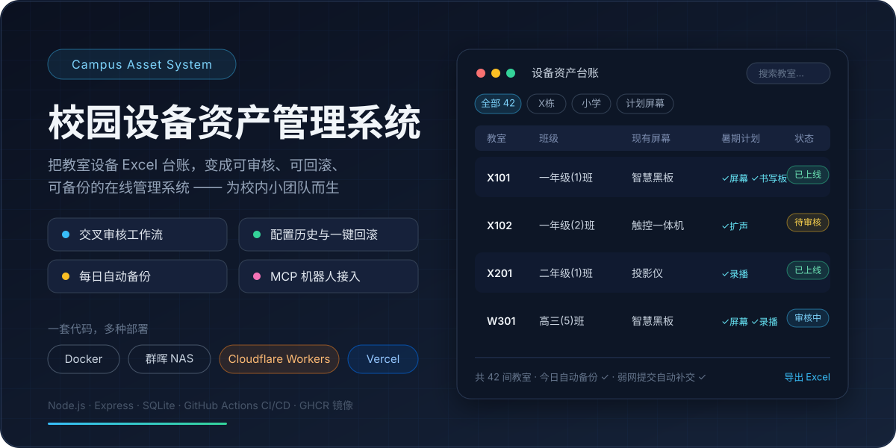

# TeachingRoom Manager

[中文](./README.md)

<div align="center">
  
</div>

TeachingRoom Manager is a lightweight browser-based classroom equipment data system.

The repository includes `初始化数据表格（虚拟）.xlsx` for first-run demonstrations. It contains synthetic data only; the application supports classroom inventory, inspection updates, review workflows, Excel import/export, audit logs, rollback, backups, and read-only base-data integration.

The app is designed for small internal teams, so the runtime stays simple: Node.js, Express, SQLite, and plain frontend assets.

## Documentation

- [Concise deployment guide](./DEPLOYMENT.en.md)
- [Complete deployment and operations manual](./docs/DEPLOYMENT.en.md)
- [Docker files guide](./docker/README.md)
- [Development notes](./DEVELOPMENT.en.md)
- [Changelog](./docs/CHANGELOG.en.md)
- [All documentation](./docs/README.en.md)

## Features

- Import demonstration records from the synthetic Excel template on first startup.
- Responsive desktop table view and mobile/tablet card view.
- Quick filtering by building, department, update plan, pending review state, and keyword.
- Super administrator, administrator, and inspector roles; inspection submissions go through cross-review before official data is updated.
- Per-classroom configuration history: old/new field values, submitter, reviewer, photos, and rollback events, displayed in Beijing time.
- Single approved-change rollback and cross-type point-in-time rollback for fields, classrooms, and photos.
- Excel uploads generate pending review requests instead of overwriting data; export Excel by current filters.
- Automatic, manual, downloadable, uploadable, and restorable database backups.
- SQLite-backed login sessions; persistent browser outbox with idempotent retry for weak-network submissions.
- Read-only base-data API and a built-in standard MCP server for other departments and bots (such as AstrBot).

## Deployment

All application data (SQLite database, photos, backups) requires **persistent storage**, which defines the limits of each platform:

| Platform | Free tier | Free lunch? | Notes |
| --- | --- | --- | --- |
| Docker Compose (own server / Synology NAS) | Already owned | ✅ **Recommended** | Prebuilt GHCR image, data stays local |
| Cloudflare Workers | 100k requests/day + DO SQLite storage | ⚠️ Experimental | Adapted; data lives in Durable Objects built-in SQLite |
| Vercel | Function execution + daily Cron | ⚠️ Experimental | Adapted; requires external Turso free remote SQLite |
| Oracle Cloud Always Free | Permanently free ARM VM (4 OCPU / 24 GB) | ✅ | Best free VM for public access |
| Google Cloud Always Free | Permanently free e2-micro VM | ✅ | Card verification required; 1 GB RAM is enough here |
| Render / Koyeb / HF Spaces | Yes | ⚠️ Demo only | Ephemeral disk loses data on restart |
| Railway / Fly.io | One-time $5 trial credit | ❌ | Charges apply once credit is used up |
| Cloudflare Containers | ❌ | ❌ | Requires the Workers Paid plan ($5/month minimum) |
| Plain Node.js (local development) | Existing computer | ✅ | Local development and lightweight deployments |

Recommended order: use Docker Compose when you have a server or NAS; pick the Workers or Vercel serverless paths for a free public deployment (the free tiers are enough for small teams); prefer own hardware when durability matters most. Platform policies change; always verify against official docs before deploying.

### Docker Compose (recommended, works for both servers and Synology NAS)

No development skills required: GitHub Actions builds the image automatically inside your own repository. You only need to fork, click run once, and start the container.

**Step 1: fork the repository and build your own image**

1. Sign in to GitHub, open this repository, and click **Fork** (top right) to copy it to your account.
2. Open the **Actions** tab of your fork; workflows are disabled on first visit — click **I understand my workflows, go ahead and enable them**.
3. Pick the **Docker** workflow on the left → **Run workflow** → confirm. Wait 5-10 minutes until it turns green ✓.
4. Back on the repository home page, the **Packages** sidebar (or your avatar → Your packages) now contains the image `teachingroom-manager-public`. Open it → **Package settings** → **Danger Zone** → **Change visibility** → set to **Public** (so the NAS and server can pull without logging in).

**Step 2: get the repository files onto the machine**

- Synology NAS: click **Code → Download ZIP** on GitHub, extract it, and use File Station to upload the whole folder to the NAS `docker` share (e.g. `/volume1/docker/teachingroom`). Upload the entire folder, not just the `docker/` subfolder.
- Server: log in over SSH and run `git clone https://github.com/<your-username>/teachingroom-manager-public.git` (or download and extract the ZIP the same way).

**Step 3: create one configuration file**

Create a `.env` file inside the repository's `docker` folder with two lines:

```bash
cd <repository>/docker
echo "SESSION_SECRET=$(openssl rand -hex 48)" > .env
echo "TEACHINGROOM_IMAGE=ghcr.io/<your-username>/teachingroom-manager-public:latest" >> .env
```

Replace `<your-username>` with your GitHub username. `SESSION_SECRET` is the site secret — any long random string works (a password generator is fine). You do not need to edit `docker-compose.yml` itself.

**Step 4: start**

```bash
docker compose pull
docker compose up -d
curl http://127.0.0.1:3000/api/health   # {"ok":true,...} means success
```

**Synology GUI start (no SSH needed)**: after steps 1-3 (the `.env` can be created in File Station with a text editor), open Container Manager → **Project** → **Create** → set the path to `/docker/teachingroom/docker` → choose "Use an existing docker-compose.yml" → step through and start.

All data lives in the `data/`, `backups/`, `uploads/`, and `exports/` folders under the repository directory — back those up (or use Hyper Backup) to preserve everything. To update later: on your fork click **Sync fork → Update branch**, wait for the Actions build to turn green, then repeat step 4 on the NAS/server.

### Cloudflare Workers (free-tier friendly, experimental)

The app is adapted for Workers: the whole Express app runs inside a single Durable Object with data stored in the DO's built-in SQLite (business code identical to local/Docker runs). **Everything happens in the browser — no local tooling required.**

**Step 1: fork the repository.** The same fork used for Docker deployment (see step 1 above; you do not need to run the Docker workflow).

**Step 2: one-click deploy to Cloudflare.** Click the button below, sign in to Cloudflare with your GitHub account, and pick your fork:

[](https://deploy.workers.cloudflare.com/?url=https%3A%2F%2Fgithub.com%2FRealKiro%2Fteachingroom-manager-public)

The button reads `wrangler.jsonc` from the repository, provisions the Durable Object and static assets, and wires up deploy-on-push. You can also do it manually: Cloudflare dashboard → **Workers & Pages** → **Create** → **Import an existing repository** → connect GitHub → pick your fork → deploy.

**Step 3: configure environment variables.** Open the Worker → **Settings** → **Variables and Secrets**, and add (values from a password generator):

- `SESSION_SECRET` (type: Secret, required)
- `INITIAL_ADMIN_PASSWORD` (recommended: first admin password, ≥12 chars)
- `CRON_SECRET` (recommended: token for scheduled backups)

**Step 4: verify.** Open `https://<project>.<your-subdomain>.workers.dev/api/health`; `{"ok":true,...}` means success. Sign in as `admin` with `INITIAL_ADMIN_PASSWORD` and change the password right away. The daily backup runs automatically via the Cron Trigger built into the repository (backups are `.sql` dumps).

Notes:

- Free plan limits: 100k requests/day; DO SQLite storage allowance is small, so keep photo sizes small (8MB per photo max).
- Restoring a 200MB uploaded database file is limited by Worker memory; prefer the "enable server backup" flow with a `.sql` dump exported by this system.
- Compatibility relies on `nodejs_compat` + `enable_nodejs_http_server_modules` (official Node HTTP server / Express support since 2025-09). The capability is new — verify fully on your own account before production use.

### Vercel (free-tier friendly, experimental)

On Vercel the database is Turso (free remote libSQL; SQLite dialect unchanged). **Browser-only as well:**

**Step 1: fork the repository.** Same as above.

**Step 2: one-click deploy to Vercel.** Click the button below, sign in to Vercel with your GitHub account, and follow the wizard:

[](https://vercel.com/new/clone?repository-url=https%3A%2F%2Fgithub.com%2FRealKiro%2Fteachingroom-manager-public&env=SESSION_SECRET,INITIAL_ADMIN_PASSWORD,CRON_SECRET&project-name=teachingroom-manager)

The wizard asks for `SESSION_SECRET` (required, from a password generator), `INITIAL_ADMIN_PASSWORD`, and `CRON_SECRET` (can be left empty for now).

**Step 3: attach the Turso database.** After deployment, open the project → **Storage / Integrations** tab → add the **Turso** integration → create or select a database. Vercel injects `LIBSQL_URL` and `LIBSQL_AUTH_TOKEN` automatically — no copy-pasting needed.

**Step 4: verify.** Open `https://<project>.vercel.app/api/health`; `{"ok":true,...}` means success. The daily backup is built into `vercel.json` (backups are `.sql` dumps stored inside the database).

<details>
<summary>Advanced: command-line deployment (optional)</summary>

```bash
npm install -g @turso/cli vercel
turso auth login
turso db create teachingroom
turso db show teachingroom --url          # → LIBSQL_URL
turso db tokens create teachingroom       # → LIBSQL_AUTH_TOKEN
vercel link
vercel env add LIBSQL_URL production
vercel env add LIBSQL_AUTH_TOKEN production
vercel env add SESSION_SECRET production   # openssl rand -hex 48
vercel --prod
```

</details>

Notes:

- Platform limits: 4.5MB request body on the free plan — photos (8MB max) and large Excel uploads will fail; compress files first; 1-3s cold starts.
- Turso's free allowance (5GB storage, ~500M row reads/month) is far more than a small team needs; check official docs for current limits.

### Serverless environment variables (Workers / Vercel)

| Variable | Required | Description |
| --- | --- | --- |
| `SESSION_SECRET` | ✅ | Session secret; instances do not share memory, so it must be explicit |
| `LIBSQL_URL` | Vercel ✅ | Turso/libSQL URL (e.g. `libsql://xxx.turso.io`); not needed on Workers |
| `LIBSQL_AUTH_TOKEN` | Vercel ✅ | Turso database token; not needed on Workers |
| `INITIAL_ADMIN_PASSWORD` | Recommended | First-boot admin password (≥12 chars); otherwise printed to the platform logs |
| `CRON_SECRET` | Recommended | Scheduled-backup token; when set, `POST /api/cron/backup` requires `Authorization: Bearer <CRON_SECRET>` |
| `BASE_DATA_API_TOKEN` | Optional | Open API/MCP token; derived deterministically from `SESSION_SECRET` when unset |
| `SKIP_SOURCE_IMPORT` | Optional | Serverless mode skips the demo Excel import by default (empty databases can import via the UI) |

### Free VMs (Oracle Cloud / Google Cloud)

After installing Docker on a permanently free VM, the deployment steps are identical to Docker Compose. Additional notes:

- On Oracle Cloud, open port 3000 both in the console Security List and the instance firewall (iptables).
- The GCP e2-micro has 1 GB of RAM, which is enough for this app (Node + SQLite uses about 100 MB), but avoid co-locating other services.
- Before exposing the app publicly, set up a reverse proxy with HTTPS and a strong random `SESSION_SECRET`.

### Cloudflare Containers (from $5/month, zero adaptation)

The prebuilt image can run directly on Cloudflare Containers, but the feature **requires the Workers Paid plan** — there is no free tier. A minimal example lives in `deploy/cloudflare/`:

```bash
npm install -g wrangler
wrangler login
cd deploy/cloudflare
wrangler deploy
```

Notes:

- **Container disk is not persistent**: SQLite data and uploaded photos are lost on restart or migration. Use it for demos and trials only.
- The image must be publicly pullable (public GHCR package or public Docker Hub repository).
- Configuration fields follow the [Cloudflare Containers documentation](https://developers.cloudflare.com/containers/).

### Plain Node.js (local development and lightweight deployments)

```bash
git clone https://github.com/RealKiro/teachingroom-manager-public.git
cd teachingroom-manager-public
npm install
npm test          # optional: run the full test suite
npm start
curl http://localhost:3000/api/health
```

For long-running local deployments, add systemd (unit template `deploy/teachingroom.service`; full steps in [DEPLOYMENT.en.md](./DEPLOYMENT.en.md)).

### First startup

First administrator account:

```text
Username: admin
Password: INITIAL_ADMIN_PASSWORD when set; otherwise written to data/initial-admin-password.txt locally, or printed to the deployment logs on serverless platforms
```

Change the administrator password immediately after first login; the generated temporary-password file is then deleted. Create inspectors and normal administrators from User Management. The app has no fixed password and does not create an inspector automatically.

If the database is empty, the app imports classroom records from `初始化数据表格（虚拟）.xlsx` (synthetic demo data only — replace or remove before production use); serverless mode skips this import by default, and empty databases can be initialized by uploading an Excel file in the UI.

## MCP Integration (AstrBot and other bot frameworks)

The server ships with a standard MCP (Model Context Protocol) endpoint at `/mcp` using the Streamable HTTP transport. It follows the MCP specification, so any MCP-capable client can connect; AstrBot's remote MCP mode is the primary integration target.

- **Auth**: shares the read-only base-data API token from `data/base-data-api-token.txt`, passed via the `X-API-Token` or `Authorization: Bearer` header.
- **Scope**: read-only tools; data changes should keep going through the web review workflow.

| Tool | Description |
| --- | --- |
| `list_classrooms` | Query the classroom inventory filtered by building, department, update plan, or keyword, with limit/offset paging |
| `get_classroom` | Fetch a single classroom by ID or room code |
| `get_fields` | List public field definitions (types and options) for building filters |
| `get_summary` | Inventory statistics (totals, building/department distribution, update plan stats) |

### AstrBot configuration example

In the AstrBot WebUI (Tools → MCP), add an MCP server using the remote Streamable HTTP mode:

```json
{
  "url": "http://<SERVER_IP>:3000/mcp",
  "transport": "streamable_http",
  "timeout": 30,
  "headers": {
    "X-API-Token": "<TOKEN>"
  }
}
```

`<TOKEN>` is the contents of `data/base-data-api-token.txt` on the server. Once saved, AstrBot completes the MCP handshake and lists the tools, so the bot can query classroom equipment directly in chat.

### Other MCP clients

Any standard MCP client can connect over Streamable HTTP to `http://<SERVER_IP>:3000/mcp` with the same auth header. When exposed to the public internet, terminate HTTPS at a reverse proxy and restrict origins as needed.

## Base Data API

The app creates a token file for read-only API access at `data/base-data-api-token.txt`:

```bash
TOKEN="$(cat data/base-data-api-token.txt)"
curl -H "X-API-Token: $TOKEN" http://localhost:3000/api/open/classrooms
```

Tokens are accepted only through `X-API-Token` or `Authorization: Bearer`; query-string tokens are rejected. Only fields explicitly marked for the public API are returned, and CORS is disabled unless an allowlist is configured.

```text
GET /api/open/meta
GET /api/open/fields
GET /api/open/summary
GET /api/open/classrooms
GET /api/open/classrooms/:id
```

Common filters:

```text
building=X栋
department=小学
orientation=南
side=南侧
planned=yes
planned=screen
planned=board
planned=audio
search=X101
```

## Runtime Defaults

```text
PORT=3000
DATA_DIR=./data
DB_PATH=./data/teachingroom.sqlite
SESSION_SECRET=<optional; generated into data/session-secret.txt when omitted>
INITIAL_ADMIN_PASSWORD=<optional first-run password; at least 12 characters>
BASE_DATA_CORS_ORIGIN=<empty by default; comma-separated allowlist>
AUTO_BACKUP_KEEP=200
BACKUP_MIRROR_DIR=<optional second backup directory>
```

## Data And Backups

Runtime data is intentionally excluded from Git:

```text
data/*.sqlite
data/base-data-api-token.txt
data/session-secret.txt
data/initial-admin-password.txt
backups/
uploads/
exports/
```

Daily automatic backups are written to `backups/`; super administrators can also create, download, upload, and enable backups from the web UI. Automatic backups retain the newest 200 files by default (`AUTO_BACKUP_KEEP`); manual and pre-restore backups remain until removed outside the app. Set `BACKUP_MIRROR_DIR` to copy backups to a second mounted disk or network directory.

## CI/CD

- Pushes to main and `v*` tags trigger GitHub Actions to run tests (Node 20/22/24 matrix), smoke-test the Workers adaptation with `wrangler dev`, build multi-arch images, and publish to GHCR after a container smoke test (plus Docker Hub when its secrets are configured).
- Pull requests build and test without publishing.
- Dependabot checks npm dependencies, the base image, and Actions versions weekly.

## Development

See [DEVELOPMENT.en.md](./DEVELOPMENT.en.md) for architecture, workflow, and repository hygiene.

## Version And Upload Log

See [TIMESTAMP_LOG.en.md](./TIMESTAMP_LOG.en.md). It records GitHub upload events, repository location, commit IDs, and handoff notes.
